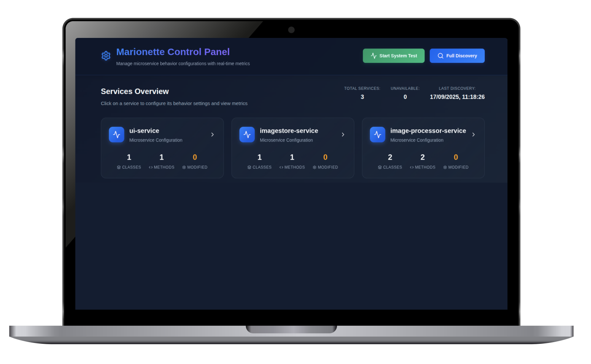
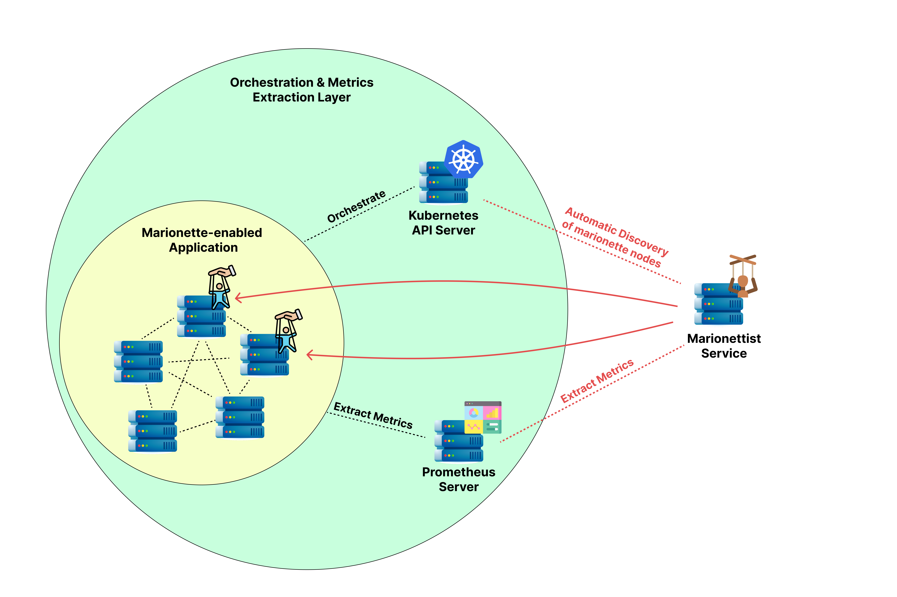
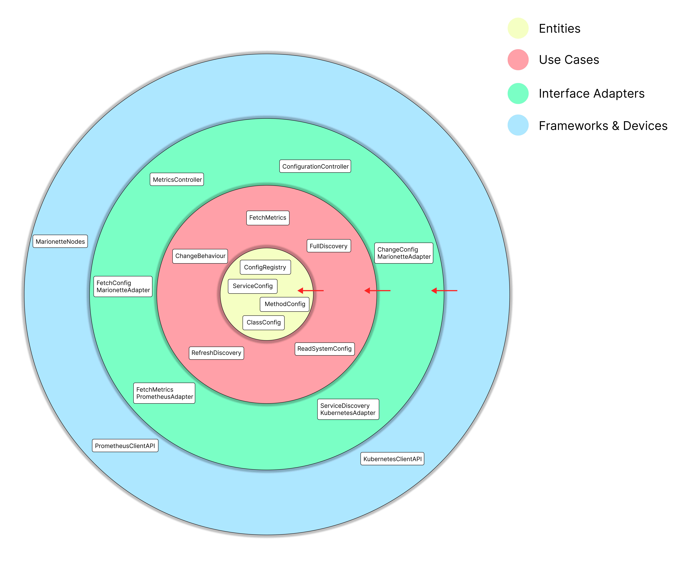

# Marionette Control Plane

<div align="center">

### A sophisticated microservices behavior management system for Kubernetes environments

*Real-time Configuration and Monitoring of Distributed Applications* 🎭

[](https://openjdk.java.net/) [](https://spring.io/projects/spring-boot) [](https://kubernetes.io/) [](LICENSE)



</div>

## What is Marionette?

Marionette is a comprehensive solution for managing microservice behaviors at runtime. It consists of two main components:

1. **Marionette Control Plane** (this repository) - Centralized management dashboard
2. **Marionette Nodes** - Instrumented nodes to be controlled

The system allows you to:
- Monitor microservice configurations in real-time
- Modify service behaviors without redeployment
- Visualize performance metrics and behavior impacts
- Target specific methods and classes for behavior injection
- Reset configurations to template defaults instantly

The complete view of the architecture can be seen here:


<div align="center">



</div>

## Architecture

This project follows **Clean Architecture** principles with clear separation of concerns. In the image it is possible to see the main components of the system divided into the traditional layers of a clean architectural style.

<div align="center">



</div>


## Features

### Core Capabilities
- **Service Discovery**: Automatic detection of Marionette-enabled services in Kubernetes
- **Behavior Management**: Runtime modification of service behaviors
- **Real-time Metrics**: Integration with Prometheus for performance monitoring
- **Web Dashboard**: Modern React-based UI for system management

## Technology Stack

### Backend
- **Java 17+** - Modern Java with records and pattern matching
- **Spring Boot 3.x** - Enterprise-grade framework
- **Kubernetes Java Client** - Native K8s integration

### Frontend
- **React 18** - Modern UI framework

### Infrastructure
- **Kubernetes** - Container orchestration
- **Prometheus** - Metrics collection and monitoring
- **Docker** - Containerization

## Prerequisites

- Java 17 or higher
- Maven 3.8+
- Docker
- Kubernetes cluster (local or remote)
- Prometheus (optional, for metrics)

## Quick Start

### 1. Clone the Repository
```bash
git clone https://github.com/yourusername/marionette-control-plane.git
cd marionette-control-plane
```

### 2. Build the Application
```bash
mvn clean package
docker build -t marionette-control-plane:latest .
```

### 3. Deploy to Kubernetes
```bash
kubectl apply -f deploy.yaml
```

### 4. Access the Dashboard
```bash
kubectl port-forward svc/marionette-control-plane 8080:8080
```
Open http://localhost:8080 in your browser.

## Configuration

### Environment Variables

#### Core Configuration
- `KUBERNETES_NAMESPACE` - Current namespace (auto-detected)
- `TARGET_NAMESPACES` - Comma-separated list of namespaces to scan
- `PROMETHEUS_URL` - Prometheus server URL for metrics

#### Metrics Configuration
Configure custom Prometheus queries using environment variables:

```bash
# Enable metrics collection
MARIONETTE_METRICS_ENABLED=true
MARIONETTE_METRICS_DEFAULT_TIME_RANGE_MINUTES=15

# Define custom metrics
MARIONETTE_METRICS_QUERIES_JVM_MEMORY_DISPLAYNAME="JVM Heap Memory"
MARIONETTE_METRICS_QUERIES_JVM_MEMORY_QUERY="jvm_memory_used_bytes{job=~\".*{service}.*\",area=\"heap\"}"
MARIONETTE_METRICS_QUERIES_JVM_MEMORY_UNIT="bytes"
MARIONETTE_METRICS_QUERIES_JVM_MEMORY_ENABLED=true
```

### Prometheus Integration

The system supports flexible Prometheus configuration through multiple sources:

1. **Environment Variables** (highest priority)
2. **Application Properties**
4. **Auto-discovery** (fallback)

## Usage

### Service Discovery
The control plane automatically discovers Marionette-enabled services by:
1. Scanning specified Kubernetes namespaces
2. Testing service endpoints for Marionette API availability
3. Fetching configuration templates from discovered services

### Behavior Modification
1. Select a service from the dashboard
2. Expand the class and method you want to modify
3. Choose a new behavior from the dropdown
4. The change is applied immediately to all service instances

### Metrics Visualization
- Toggle metrics panel for any service
- View real-time and historical data
- Customize time ranges and refresh intervals
- Monitor the impact of behavior changes

### Template Management
- View current vs. template configurations
- Reset individual services to their templates
- Track configuration drift over time

## Development

### Project Structure
```
src/main/java/org/marionette/controlplane/
├── adapters/              # External integrations
│   ├── inbound/          # Controllers, DTOs
│   └── outbound/         # External service clients
├── domain/               # Core business logic
│   ├── entities/         # Domain entities
│   ├── values/          # Value objects
│   └── helpers/         # Domain utilities
├── usecases/            # Application services
│   ├── inbound/         # Use case interfaces
│   └── outbound/        # Port definitions
├── di/                  # Dependency injection
└── exceptions/          # Custom exceptions

src/main/resources/static/  # React frontend
```

## Security

### RBAC Configuration
The system requires appropriate Kubernetes permissions:

```yaml
apiVersion: rbac.authorization.k8s.io/v1
kind: ClusterRole
metadata:
  name: marionette-control-plane-role
rules:
- apiGroups: [""]
  resources: ["services", "endpoints", "pods"]
  verbs: ["get", "list"]
```

## Troubleshooting

### Common Issues

#### Service Discovery Not Working
```bash
# Check RBAC permissions
kubectl auth can-i get services --as=system:serviceaccount:outfit-app:marionette-control-plane-sa

# Verify service account binding
kubectl get clusterrolebinding marionette-control-plane-binding -o yaml
```

#### Metrics Not Loading
```bash
# Test Prometheus connectivity
kubectl exec -it deployment/marionette-control-plane -- curl http://prometheus:9090/api/v1/query?query=up

# Check environment variables
kubectl get pods -l app=marionette-control-plane -o yaml | grep -A 20 env:
```

#### Configuration Changes Not Applied
```bash
# Check pod connectivity to target services
kubectl exec -it deployment/marionette-control-plane -- curl http://target-service:8080/marionette/api/isMarionette

# View logs
kubectl logs -l app=marionette-control-plane -f
```
